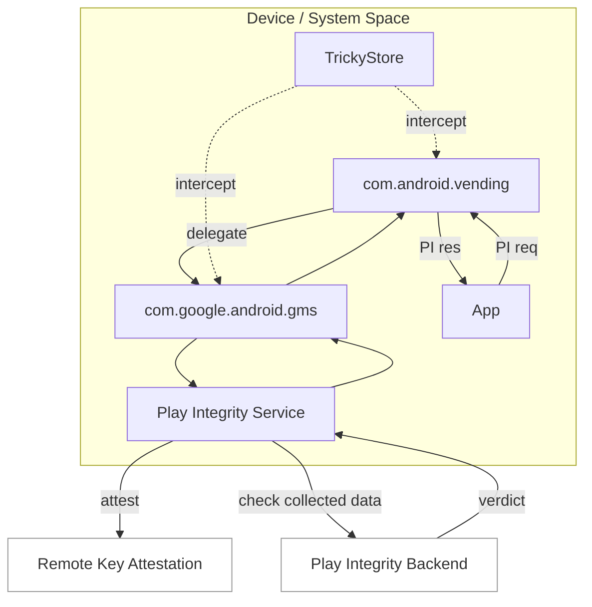

# Remote Key Attestation (RKA) Research (Implementation Notes)

Language: [English](./README.md) | [繁體中文](./README.zh.md)

This repository contains my **implementation notes** for RKA, for research purposes only.

---

## Why This Work

Android Key Attestation is a core signal for device trust. In recent years, broad adoption of RKP (Remote Key Provisioning) shifted certificate-chain sourcing from on-device generation to remote provisioning. This changes the threat model and also affects how verifiers should evaluate trust.  
Because of that, I focused on **RKA implementation feasibility** and **real-world behavior**.

---

## Flow Diagram



Note: this is a simplified flow.

## Test Information (Public)

Basic test-environment details are listed below, without implementation specifics:

- Test Date: 2026-02-07
- Test App Version: Google Play 49.9.19-31
- Video: A public operation demo is attached (no technical implementation details)

---

## References

Guardsquare public research report:
```
https://www.guardsquare.com/blog/bypassing-key-attestation-api
```

PlayStrong public flow diagram:
```
https://t.me/meetstrong/107
```

TrickyStore:
```
https://github.com/5ec1cff/TrickyStore
```

---

## Video and Appendix

- RKA Demo Video (MP4, 24 MB): [`rka-demo.mp4`](./rka-demo.mp4)

## Co-contributor

- GitHub: [@lokey0905](https://github.com/lokey0905)
