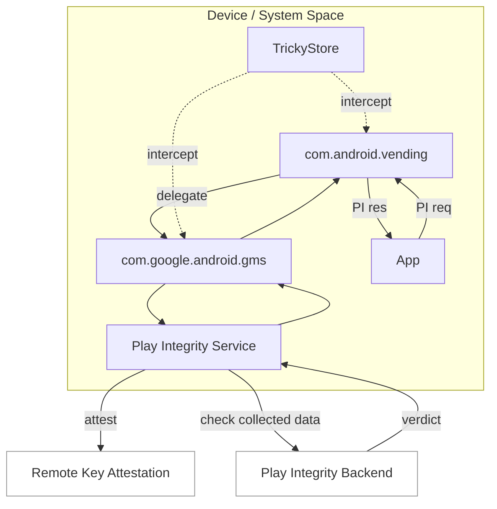

# Remote Key Attestation (RKA) Research (Implementation Notes)

Language: [English](./README.md) | [繁體中文](./README.zh.md)

This repository contains my **implementation notes** for RKA, for research purposes only.

---

## Video and Appendix

- Live Demo (GitHub attachment):

https://github.com/user-attachments/assets/4db9bcc0-fdab-4f81-a548-5d00b5cb15f6

- Local File (MP4, 24 MB): [`rka-demo.mp4`](./rka-demo.mp4)

### Video Walkthrough

1. The video starts by showing the Google Play version and that TrickyStore is configured to not intercept Play Services.
2. It then uses key attestation to show that the current device is in BL (bootloader-unlocked) state.
3. Using Google Play Integrity API Checker, only `BASIC` integrity is obtained.
4. After switching to a custom TrickyStore setup, remote key attestation signing is performed.
5. The key attestation app then shows the status changed to `RemoteKeyProvisioner (RKP)`.
6. The final result successfully reaches `STRONG_INTEGRITY`.

---

## Why This Work

Android Key Attestation is a core signal for device trust. In recent years, broad adoption of RKP (Remote Key Provisioning) shifted certificate-chain sourcing from on-device generation to remote provisioning. This changes the threat model and also affects how verifiers should evaluate trust.  
Because of that, I focused on **RKA implementation feasibility** and **real-world behavior**.

---

## Test Information (Public)

Basic test-environment details are listed below, without implementation specifics:

- Test Date: 2026-02-07
- Test App Version: Google Play 49.9.19-31
- Video: A public operation demo is attached (no technical implementation details)

---

## Flow Diagram



Note: this is a simplified flow.

---

## References

Guardsquare public research report:
```
https://www.guardsquare.com/blog/bypassing-key-attestation-api
```

PlayStrong public flow diagram:
```
https://t.me/meetstrong/107
```

TrickyStore:
```
https://github.com/5ec1cff/TrickyStore
```

---

## Co-contributor

- GitHub: [@lokey0905](https://github.com/lokey0905)
