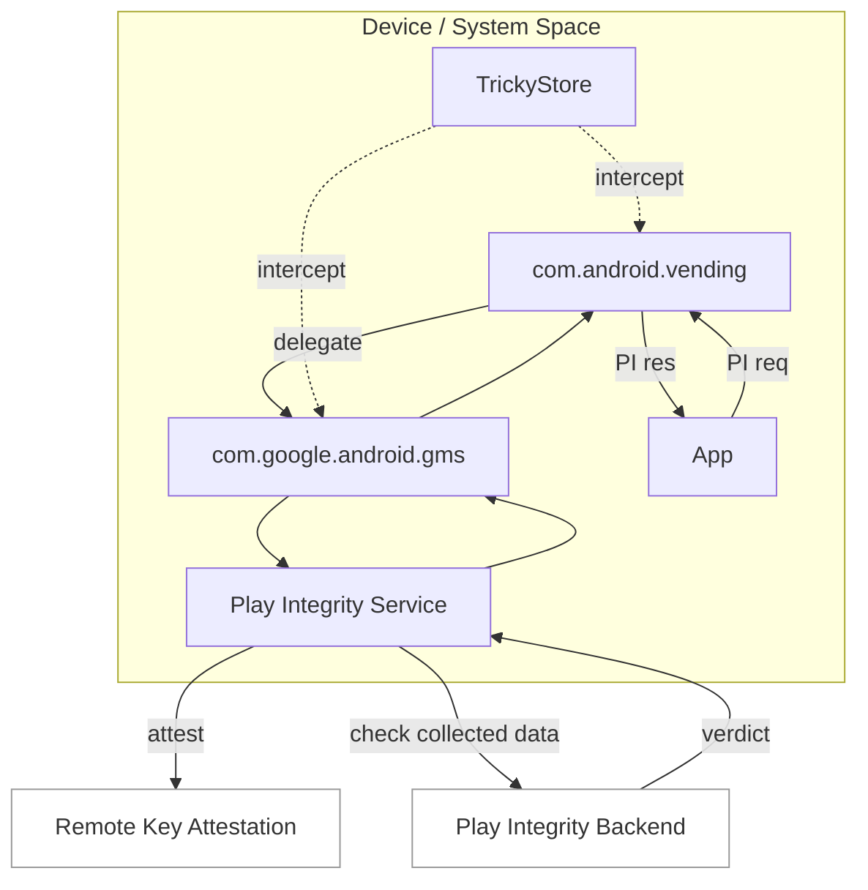

# 遠端 Key Attestation（RKA）研究（實作整理）

語言： [English](./README.md) | [繁體中文](./README.zh.md)

這篇是我做 RKA 的**實作整理**，僅作研究用途。

---

## 影片與附錄

- 線上播放（GitHub 附件）：

https://github.com/user-attachments/assets/4db9bcc0-fdab-4f81-a548-5d00b5cb15f6

- RKA Demo 影片（MP4, 24 MB）：[`rka-demo.mp4`](./rka-demo.mp4)

### 影片內容摘要

1. 一開始先顯示 Google Play 版本資訊，並顯示 TrickyStore 設定狀態為不攔截 Play Services。
2. 透過 key attestation 顯示目前裝置是 BL。
3. 使用 Google Play Integrity API Checker，結果僅取得 `BASIC` 認證。
4. 切換為自訂的 TrickyStore 設定後，使用 remote key attestation 進行簽署。
5. 可以透過 key attestation app 顯示狀態變成 `RemoteKeyProvisioner (RKP)`。
6. 最後成功取得 `STRONG_INTEGRITY`。

---

## 為什麼要做

Android 的 Key Attestation 是「裝置可信度」的重要依據。近年開始大量導入 RKP（Remote Key Provisioning），使憑證鏈的來源從「裝置內部」轉向「遠端配發」。這改變了風險模型，也影響驗證端該如何判斷可信度；因此我把重點放在 **RKA 的實作可行性** 與 **實際運作狀況**。

---

## 測試資訊（公開可見）

下面是測試環境的基本資訊，不包含任何實作細節：

- 測試日期：2026-02-07  
- 測試 App 版本：Google Play 49.9.19-31  
- 影片：我會附上可公開的運作影片（不含技術細節）  

---

## 流程圖



註：此流程是簡化版本

---

## 參考來源

GuardSquare 的公開研究報告： 
```
https://www.guardsquare.com/blog/bypassing-key-attestation-api
```

PlayStrong 的公開流程圖
```
https://t.me/meetstrong/107
```

TrickStore
```
https://github.com/5ec1cff/TrickyStore
```

---

## 共同貢獻者

- GitHub：[@lokey0905](https://github.com/lokey0905)
